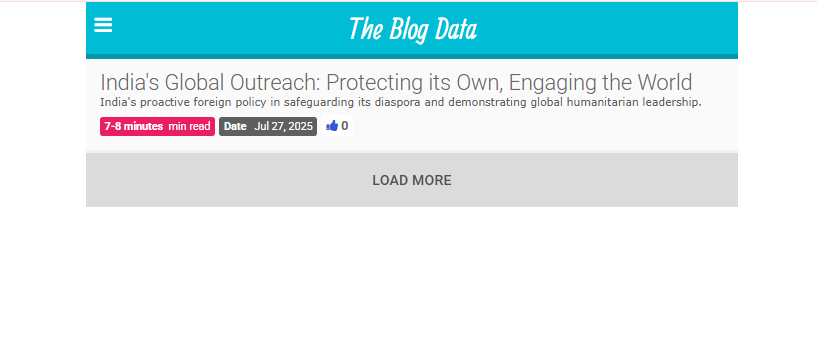
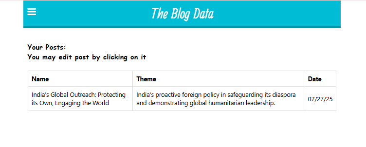
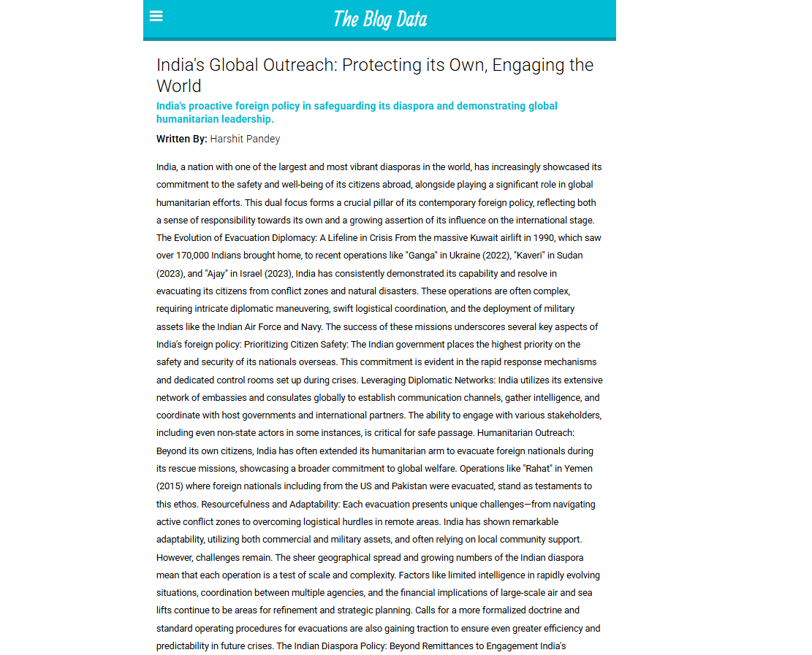
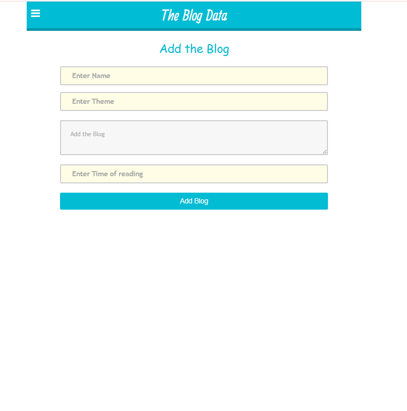
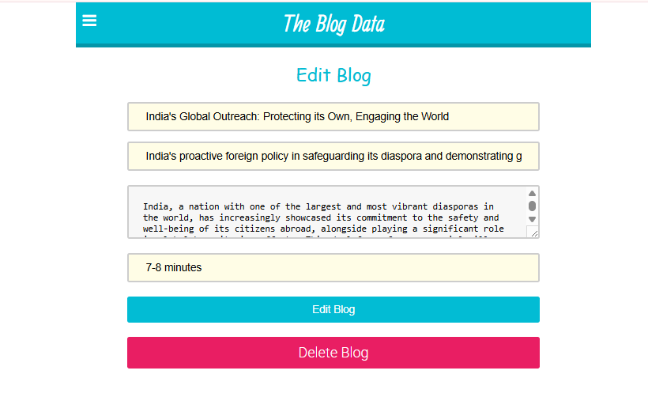
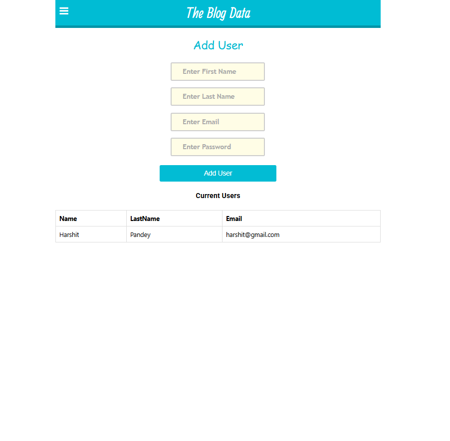
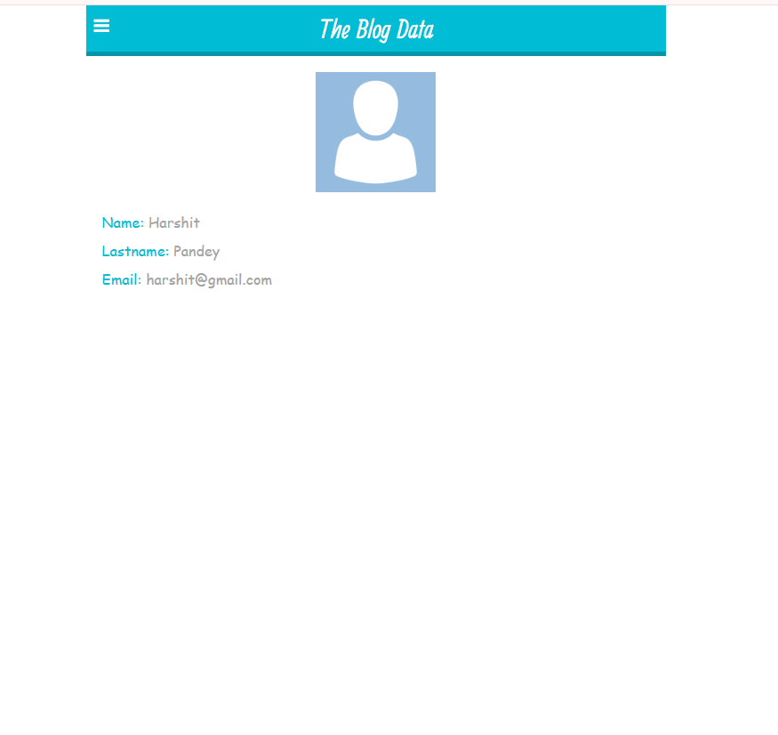

📝 Blog Application (MERN Stack)
A full-stack web application that allows authenticated users to:

✅ Register and sign in

📖 Read blogs posted by other users

✍️ Create, edit, and delete their own blogs

❤️ Like and interact with blogs

🛠️ Tech Stack
Frontend

⚛️ React.js – Builds a dynamic and responsive user interface

🧠 Redux – Manages global state across components

Backend

🖥️ Node.js – Runtime environment for server-side logic

🚂 Express.js – Handles routing and API logic

Database

🍃 MongoDB – Stores user accounts and blog data

📌 Features
Secure authentication and authorization

CRUD functionality for blog posts

Like system for user interaction

Fully responsive and user-friendly UI

