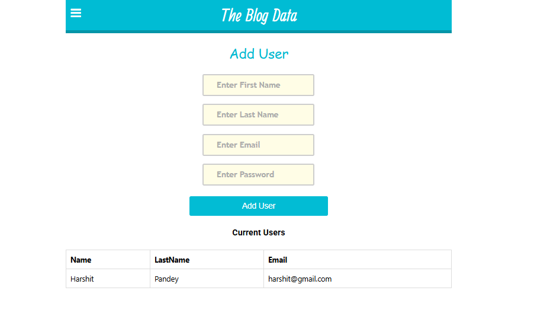
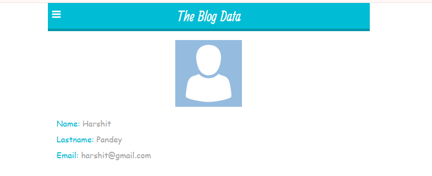

# 📝 Blog Application (MERN Stack)

A full-stack web application that allows authenticated users to:

- ✅ Register and sign in
- 📖 Read blogs posted by other users
- ✍️ Create, edit, and delete their own blogs
- ❤️ Like and interact with blogs

---

## 🛠️ Tech Stack

### Frontend

- ⚛️ **React.js** – Builds a dynamic and responsive user interface
- 🧠 **Redux** – Manages global state across components
- 🎨 **CSS** – Custom styling for all components

### Backend

- 🖥️ **Node.js** – Server-side runtime environment
- 🚂 **Express.js** – Handles routing and API logic
- 🔒 **JWT** – Secure authentication mechanism

### Database

- 🍃 **MongoDB** – Stores user and blog data

---

## 📌 Features

- 🔐 Secure user authentication and authorization
- 📝 Full CRUD operations for blog posts
- ❤️ Like functionality to engage with blogs
- 📱 Fully responsive and user-friendly interface
- 👤 User profiles with personal blog management
- 🔍 Browse all published blogs in a central feed

---

## 🚀 Installation & Setup

### Prerequisites

- Node.js (v14+)
- npm or yarn
- MongoDB instance (local or Atlas)

### Clone the repository

```bash
git clone https://github.com/Harshitpandey993/Blog.git
cd Blog
```

### Frontend Setup

```bash
cd client
npm install
```

### Backend Setup

```bash
cd server
npm install
```

### Environment Configuration

Create a `.env` file in the server directory with:

```
MONGODB_URI=your_mongodb_connection_string
JWT_SECRET=your_jwt_secret_key
PORT=5000
```

---

## 🏃‍♂️ Running the Application

### Start the Backend Server

```bash
cd server
npm start
```

### Start the Frontend Application

```bash
cd client
npm start
```

The application will be available at `http://localhost:3000`

---

## 📷 Screenshots






---

## 👥 Contributing

Contributions are welcome! Please feel free to submit a Pull Request.
